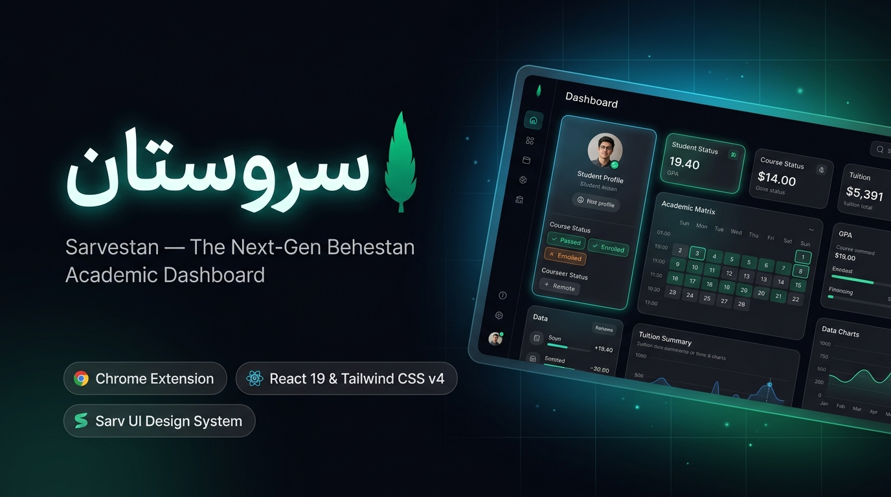

<div align="center">

# 

# 🌿 سروستان | Sarvestan

### داشبورد نسل جدید، مدرن و سریع برای سامانه **بهستان**
**دانشگاه صنعتی خواجه‌نصیرالدین طوسی**  
*(در تلاش برای پشتیبانی از تمامی دانشگاه‌های مبتنی بر بهستان)*

[](https://mjb4khshi.github.io/sarvestan/)
[-2563eb?style=for-the-badge&logo=googlechrome&logoColor=white)](https://mjb4khshi.github.io/sarvestan/sarvestan-extension.zip)
[](https://github.com/mjb4khshi/sarvestan/releases)

<br/>

[](https://react.dev)
[](https://tailwindcss.com)
[](https://github.com/mjb4khshi/sarv-ui)
[](LICENSE)

<br/>

**سروستان** یک افزونه مدرن مرورگر (کروم و اج) است که سامانه دانشگاهی قدیمی بهستان را به یک وب‌اپلیکیشن فوق‌العاده سریع، مینیمال، هوشمند و زیبا با زبان طراحی **Sarv UI** تبدیل می‌کند؛ بدون هیچ دیتای هاردکد، با حفظ کامل امنیت و حفظ حریم خصوصی دانشجو.

</div>

---

## ⚡ امکانات و قابلیت‌ها

| بخش | ویژگی‌ها و امکانات | فرم‌های بهستان مرتبط |
| :--- | :--- | :--- |
| **میز کار جامع** | نمایش خلاصه‌وضعیت تحصیلی، معدل کل، واحدهای گذرانده، تراز شهریه، کلاس‌های امروز و دسترسی سریع | `F1825`, `F1814` |
| **کارنامه و نمرات** | ریز نمرات همه ترم‌ها، وضعیت قبولی/مردودی، محاسبه آنلاین معدل ترم و معدل کل، فیلتر و جستجو | `F1825` |
| **برنامه هفتگی و امتحانات** | تقویم ماتریسی هفتگی با تفکیک روز و ساعت، کارت ورود به جلسه آزمون و تاریخ امتحانات | گزارش‌های `78`, `88`, `428` |
| **امور مالی و شهریه** | صورتحساب ریزتراز، بدهی و بستانکاری، چاپ رسمی رسید و ارجاع امن به درگاه‌های بهستان | `F1825`, `F4563` |
| **چارت و وضعیت دروس** | دسته‌بندی هوشمند دروس (پایه، عمومی، تخصصی، اختیاری)، رنگ‌بندی بج‌های وضعیت (پاس شده، در جریان، مردود) | `F1825`, `F1814` |
| **پیشخوان و نامه‌ها** | مشاهده گردش‌کارهای فعال و آرشیوشده، پیگیری درخواست‌های آموزشی، گواهی اشتغال به تحصیل | `F6524` |
| **شخصی‌سازی و تم‌ها** | تم‌های متعدد شامل پرشین دارک، پرشین لایت، سان‌ست، ماچا، نوردیک، ترنزیشن روان ۶۰۰ میلی‌ثانیه‌ای و فونت آراد | **Sarv UI Tokens** |

---

## 📥 راهنمای دانلود و نصب

### ۱. دریافت فایل افزونه
شما می‌توانید آخرین نسخه آماده افزونه را از یکی از دو مسیر زیر دریافت کنید:
* **[دانلود مستقیم آخرین نسخه فشرده (sarvestan-extension.zip)](https://mjb4khshi.github.io/sarvestan/sarvestan-extension.zip)**
* **[صفحه Releases در گیت‌هاب](https://github.com/mjb4khshi/sarvestan/releases)**

### ۲. نصب در مرورگر (Chrome / Edge / Brave / Opera)
1. فایل زیپ دریافت‌شده (`sarvestan-extension.zip`) را در یک پوشه مناسب **Unzip (Extract)** کنید.
2. مرورگر کروم را باز کنید و آدرس `chrome://extensions` را وارد نمایید.
3. در گوشه بالا سمت راست، گزینه **Developer mode** را فعال کنید.
4. دکمه **Load unpacked** را بزنید و پوشه اکسترکت‌شده (که شامل فایل `manifest.json` است) را انتخاب کنید.
5. سامانه **[behestan.kntu.ac.ir](https://behestan.kntu.ac.ir/)** را باز کرده و لاگین کنید؛ داشبورد مدرن سروستان به صورت خودکار فعال می‌شود!

---

## 🔒 امنیت و حریم خصوصی

* **پردازش کاملاً محلی (Client-side):** افزونه مستقیماً درون مرورگر شما اجرا می‌شود و هیچ سرور واسطه‌ای وجود ندارد.
* **بدون ذخیره اطلاعات محرمانه:** نام کاربری، رمز عبور و اطلاعات مالی شما به هیچ سرور خارجی ارسال نمی‌شود.
* **پرداخت شهریه در بستر امن:** عملیات پرداخت شهریه صرفاً از طریق ارجاع امن به درگاه‌های شاپرک رسمی خود بهستان انجام می‌گیرد.

---

## 🛠 توسعه و بیلد محلی

```bash
# نصب وابستگی‌ها
npm install

# اجرای نسخه دمو در محیط توسعه (Vite dev server)
npm run dev

# بیلد نهایی پروژه
npm run build

# بسته‌بندی خودکار افزونه برای انتشار و تسترها
npm run pack
```

### ساختار پوشه‌های کلیدی:
```text
├── public/                 # مانیفست افزونه (manifest.json)، اسکریپت‌های محتوا و رهگیری بهستان
├── src/
│   ├── components/sarv/    # کامپوننت‌های رسمی Sarv UI (بج، دکمه، اینپوت، چک‌باکس و ...)
│   ├── modules/            # ماژول‌های داشبورد (کارنامه، برنامه هفتگی، چارت دروس، مالی و ...)
│   ├── services/           # سرویس‌های خواندن داده از بهستان و کش محلی
│   └── App.jsx             # روت اصلی و لندینگ پیج
├── scripts/                # اسکریپت‌های بسته‌بندی افزونه (pack-extension.ps1)
└── docs/                   # بنر رسمی، اسکرین‌شات‌ها و مستندات
```

---

## 🤝 قدردانی و تشکر

* با تشکر ویژه از **اشکان جلالی** ([@ashkanjalaliQ](https://github.com/ashkanjalaliQ)) بابت ایده‌پردازی‌ها و همفکری‌های ارزشمند در مسیر بازطراحی سامانه‌های دانشگاهی.
* طراحی و توسعه‌یافته بر پایه زبان طراحی [**Sarv UI**](https://github.com/mjb4khshi/sarv-ui).

---

## 📄 لایسنس

این پروژه تحت مجوز [MIT](LICENSE) منتشر شده است.

---

<div align="center">
  <a href="https://github.com/mjb4khshi">
    
  </a>
  <br/>
  <sub>
    طراحی و توسعه با عشق و چای توسط
    <a href="https://github.com/mjb4khshi"><strong>محمدجواد بخشی (@mjb4khshi)</strong></a>
  </sub>
</div>
